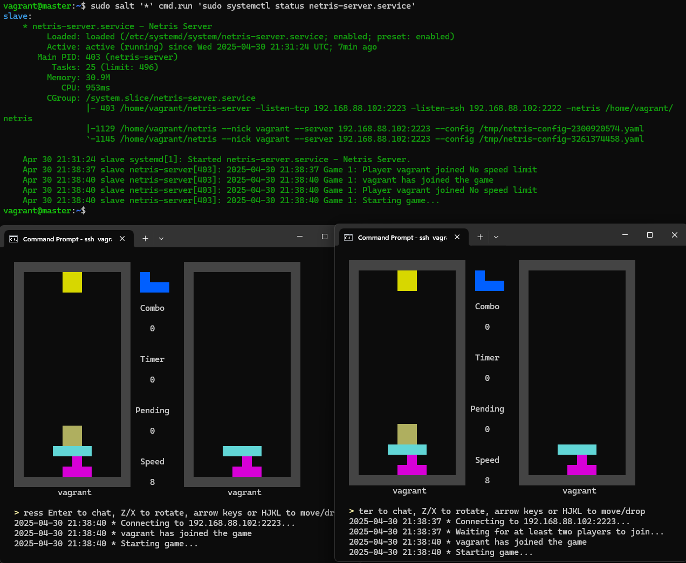

# Netris Salt & Vagrant Module

**Note: This is student project for [Configuration Management Systems 2025 course](https://terokarvinen.com/palvelinten-hallinta/) made by [Kasper Nurminen](https://github.com/nurminenkasper/)**

Netris Salt & Vagrant Module is basically a Salt Module with Vagrantfile, that automates the process of setting up Vagrant master & minion and proceeds to setup [Netris Multiplayer Tetris Clone](https://github.com/warmchang/netris) server with SaltStack.

## Installation Guide

**Pre-requisites:**
- [Vagrant](https://developer.hashicorp.com/vagrant/install)

### 1. Clone netris-salt-vagrant-module
Clone the GitHub Repository to your master machine that has Vagrant installed.

        git clone https://github.com/nurminenkasper/netris-salt-vagrant-module.git

### 2. Start Vagrant machines
Start Vagrant machines with `Vagrant up`

Once installation progress is finished, connect to master machine with `vagrant ssh master`

Once you are in, you have to accept minions key with `sudo salt-key -A`

### 3. Apply Salt state
Start the server with applying Salt state to minion machine.

        sudo salt '*' state.apply netris

### 4. Play Netris
All done. Netris should launch from any CMD/Terminal with `ssh vagrant@192.168.88.102 -p 2222`.

### 5. Extra
You can configure the Vagrantfile and /srv/salt/netris/files IP & Port to your liking.